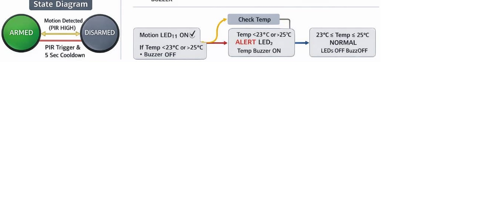

# ESP32-PIR-Temperature-Security-System
Embedded ESP32-based security system integrating PIR motion detection and DS18B20 temperature monitoring. The system supports armed/disarmed logic, real-time OLED status display, persistent motion alerts, and temperature-based alarms using LEDs and buzzer.

## 📌 Overview
This project implements an embedded security system using the ESP32 microcontroller.  
It combines motion detection and temperature monitoring with a clear user interface on an OLED display.

The system supports an *ARMED / DISARMED* state model and triggers visual and audible alerts based on sensor conditions.

---

## 🔧 Features
- PIR-based motion detection
- DS18B20 digital temperature monitoring
- Armed / Disarmed system logic
- Persistent motion indicator LED
- Temperature alert LED and buzzer
- Real-time status display on OLED
- Finite State Machine behavior

---

## 🧰 Hardware Components
- ESP32 Development Board (30-pin)
- PIR Motion Sensor (HC-SR501)
- DS18B20 Temperature Sensor
- OLED Display (SSD1306, I2C)
- 2 × LEDs + current-limiting resistors
- Active Buzzer
- Breadboard & Jumper Wires

---

## 🔌 Pin Configuration

| Component | ESP32 Pin |
|---------|-----------|
| PIR OUT | GPIO 4 |
| DS18B20 DATA | GPIO 16 |
| Motion LED | GPIO 2 |
| Temperature LED | GPIO 5 |
| Buzzer | GPIO 15 |
| OLED SDA | GPIO 21 |
| OLED SCL | GPIO 22 |

---

## 🖥 System Logic
- PIR toggles system between ARMED and DISARMED states
- When ARMED:
  - Motion activates persistent alert LED
  - Temperature outside 23–25°C triggers LED + buzzer
- OLED displays system state, temperature, and alert status

---

## 📷 Visual Documentation

### Wiring

### OLED Output

### Circuit Diagram

### State Diagram

## Demo Video
A short demonstration video is included to showcase system behavior.

---

## ▶️ How to Run
1. Open the .ino file in Arduino IDE
2. Install required libraries:
   - OneWire
   - DallasTemperature
   - Adafruit SSD1306
   - Adafruit GFX
3. Select *ESP32 Dev Module*
4. Upload the code
5. Power the circuit and observe system behavior

---

## 👤 Author
*Milad Mohseni*

---

## ⚠️ Notes
This project is designed as an embedded-system-level implementation and follows real-world security logic patterns.
